# Soniox API Docs — tổng hợp endpoint, kết nối, luồng

> Nguồn: crawl từ `https://soniox.com/docs/` bằng Firecrawl trong session này.  
> Phạm vi: Speech-to-Text (STT), Speech Translation, Text-to-Speech (TTS), Auth temporary API keys, quản lý file/transcription, usage/concurrency, error handling.  
> Lưu ý: tài liệu Soniox có thể thay đổi; khi triển khai production nên đối chiếu lại trang nguồn trong phần **Nguồn tham khảo**.

## 1. Tổng quan nhanh

| Mảng | API chính | Giao thức | Dùng khi |
|---|---|---|---|
| STT real-time | `wss://stt-rt.soniox.com/transcribe-websocket` | WebSocket | Live captions, voice agent, meeting/broadcast transcription, streaming translation |
| STT async | `https://api.soniox.com/v1/transcriptions` | REST | File audio đã ghi, xử lý nền, webhook/polling |
| File management | `https://api.soniox.com/v1/files` | REST multipart/JSON | Upload file local trước khi tạo transcription |
| Speech translation | STT WebSocket hoặc STT async + `translation` config | WebSocket/REST | Dịch giọng nói real-time hoặc file ghi âm |
| TTS REST | `https://tts-rt.soniox.com/tts` | REST streaming response | Có full text/utterance, cần audio bytes một lần |
| TTS real-time | `wss://tts-rt.soniox.com/tts-websocket` | WebSocket | Voice agent/LLM streaming, cần phát audio sớm khi text chưa hoàn tất |
| Temporary API key | `https://api.soniox.com/v1/auth/temporary-api-key` | REST | Cấp key ngắn hạn cho browser/mobile, tránh lộ API key thật |
| Usage/concurrency | `/v1/usage-logs`, `/v1/concurrency-limits` | REST | Theo dõi chi phí, request, quota, concurrent usage |

## 2. Base URL và authentication

### 2.1 Base URL

| Nhóm | Base/Endpoint |
|---|---|
| REST API chung | `https://api.soniox.com/v1` |
| STT real-time WebSocket | `wss://stt-rt.soniox.com/transcribe-websocket` |
| TTS REST | `https://tts-rt.soniox.com/tts` |
| TTS real-time WebSocket | `wss://tts-rt.soniox.com/tts-websocket` |

### 2.2 Authentication theo giao thức

| Giao thức | Cách auth | Ghi chú |
|---|---|---|
| REST `api.soniox.com` | Header `Authorization: Bearer <SONIOX_API_KEY>` | Dùng API key permanent từ Soniox Console |
| TTS REST | Header `Authorization: Bearer <SONIOX_API_KEY>` hoặc temporary key đúng scope | Temporary key phải có `usage_type: "tts_rt"` |
| STT WebSocket | Field `api_key` trong message config đầu tiên | Chấp nhận API key permanent hoặc temporary key `usage_type: "transcribe_websocket"` |
| TTS WebSocket | Field `api_key` trong config mỗi stream | Chấp nhận API key permanent hoặc temporary key `usage_type: "tts_rt"` |

### 2.3 Temporary API key

Temporary key dùng để client trực tiếp gọi Soniox mà không lộ API key thật. Backend giữ API key permanent, gọi Soniox để tạo temporary key, rồi trả temporary key cho browser/mobile.

```http
POST https://api.soniox.com/v1/auth/temporary-api-key
Authorization: Bearer <SONIOX_API_KEY>
Content-Type: application/json
```

Body:

```json
{
  "usage_type": "transcribe_websocket",
  "expires_in_seconds": 3600,
  "client_reference_id": "user-123-session-456",
  "single_use": true,
  "max_session_duration_seconds": 1800
}
```

| Field | Bắt buộc | Kiểu | Ghi chú |
|---|---:|---|---|
| `usage_type` | Có | string | `"transcribe_websocket"` hoặc `"tts_rt"` |
| `expires_in_seconds` | Có | integer | 1..3600 giây |
| `client_reference_id` | Không | string | Tối đa 256 ký tự |
| `single_use` | Không | boolean | Nếu `true`, key dùng một lần |
| `max_session_duration_seconds` | Không | integer | 1..18000 giây; quá hạn session trả 403 |

Response `201`:

```json
{
  "api_key": "temp:WYJ67RBEFUWQXXPKYPD2UGXKWB",
  "expires_at": "2025-02-22T22:47:37.150Z"
}
```

Điểm quan trọng:

- Temporary key bị giới hạn theo `usage_type`. Dùng sai action sẽ bị `401 unauthenticated`.
- Nếu key có `max_session_duration_seconds` và session vượt hạn, API trả `403 temp_api_key_session_expired`.
- `client_reference_id` trong request dùng temporary key bị ignore theo docs.
- Browser/mobile không nên dùng API key permanent.

## 3. Danh sách endpoint API

### 3.1 Auth

| Method | Endpoint | Mục đích | Auth | Request chính | Response chính |
|---|---|---|---|---|---|
| `POST` | `/auth/temporary-api-key` | Tạo temporary API key ngắn hạn | Bearer permanent API key | `usage_type`, `expires_in_seconds`, optional `single_use`, `max_session_duration_seconds` | `{api_key, expires_at}` |

Full URL:

```text
https://api.soniox.com/v1/auth/temporary-api-key
```

### 3.2 STT real-time WebSocket

| Giao thức | Endpoint | Mục đích |
|---|---|---|
| WebSocket | `wss://stt-rt.soniox.com/transcribe-websocket` | Real-time transcription và speech-to-text translation |

Config message đầu tiên:

```json
{
  "api_key": "<SONIOX_API_KEY|SONIOX_TEMPORARY_API_KEY>",
  "model": "stt-rt-v4",
  "audio_format": "auto",
  "language_hints": ["en", "es"],
  "context": {
    "general": [
      { "key": "domain", "value": "Healthcare" },
      { "key": "topic", "value": "Diabetes management consultation" }
    ],
    "text": "Extra background context for the conversation.",
    "terms": ["Celebrex", "Zyrtec"],
    "translation_terms": [
      { "source": "stroke", "target": "ictus" }
    ]
  },
  "enable_speaker_diarization": true,
  "enable_language_identification": true,
  "enable_endpoint_detection": true,
  "max_endpoint_delay_ms": 2000,
  "translation": {
    "type": "two_way",
    "language_a": "en",
    "language_b": "es"
  }
}
```

Parameters chính:

| Field | Bắt buộc | Ghi chú |
|---|---:|---|
| `api_key` | Có | API key hoặc temporary key `transcribe_websocket` |
| `model` | Có | Real-time STT model, ví dụ `stt-rt-v4` |
| `audio_format` | Có | `auto` hoặc raw format |
| `num_channels` | Có nếu raw | Số kênh audio |
| `sample_rate` | Có nếu raw | Sample rate Hz |
| `language_hints` | Không | Gợi ý ngôn ngữ, không khóa cứng nếu không dùng strict |
| `language_hints_strict` | Không | Ràng buộc chặt hơn theo hints nếu model hỗ trợ |
| `context` | Không | Tăng accuracy/formatting/terms |
| `enable_speaker_diarization` | Không | Tách speaker labels |
| `enable_language_identification` | Không | Gắn language theo token/segment |
| `enable_endpoint_detection` | Không | Semantic endpointing, finalize utterance nhanh hơn |
| `max_endpoint_delay_ms` | Không | 500..3000, default 2000 |
| `client_reference_id` | Không | Tracking trong usage logs; bị ignore với temporary key |
| `translation` | Không | One-way/two-way translation config |

Audio streaming:

- Sau config, gửi audio bằng binary WebSocket frames.
- Nếu gửi text frame chứa audio thì phải là base64 chuẩn; binary frame đơn giản hơn.
- Kết thúc stream bằng empty WebSocket frame (binary hoặc text).
- Mỗi real-time STT session tối đa 300 phút audio.

Response thành công:

```json
{
  "tokens": [
    {
      "text": "Hello",
      "start_ms": 600,
      "end_ms": 760,
      "confidence": 0.97,
      "is_final": true,
      "speaker": "1",
      "language": "en"
    }
  ],
  "final_audio_proc_ms": 760,
  "total_audio_proc_ms": 880
}
```

Finished response:

```json
{
  "tokens": [],
  "final_audio_proc_ms": 1560,
  "total_audio_proc_ms": 1680,
  "finished": true
}
```

Error response:

```json
{
  "tokens": [],
  "error_code": 503,
  "error_type": "service_unavailable",
  "error_message": "Cannot continue request (code 11). Please restart the request.",
  "more_info": "https://soniox.com/docs/api-reference/errors#service-unavailable",
  "request_id": "3d37a3bd-5078-47ee-a369-b204e3bbedda"
}
```

STT WebSocket error sẽ đóng connection sau khi gửi error.

### 3.3 STT async — Transcriptions

Base:

```text
https://api.soniox.com/v1
```

| Method | Endpoint | Mục đích | Request chính | Response chính |
|---|---|---|---|---|
| `POST` | `/transcriptions` | Tạo async transcription/translation job | `model`, `audio_url` hoặc `file_id`, optional language/context/webhook/translation | Transcription object status `queued|processing|completed|error` |
| `GET` | `/transcriptions` | List transcriptions | Query `limit`, `cursor` | `{transcriptions, next_page_cursor}` |
| `GET` | `/transcriptions/count` | Count transcriptions theo scope | Không | `{playground, public_api, total}` |
| `GET` | `/transcriptions/{transcription_id}` | Lấy detail transcription | Path `transcription_id` UUID | Transcription object |
| `GET` | `/transcriptions/{transcription_id}/transcript` | Lấy transcript đã hoàn tất | Path `transcription_id` UUID | `{id, text, tokens}` |
| `DELETE` | `/transcriptions/{transcription_id}` | Xóa transcription và associated files | Path `transcription_id` UUID | `204` empty |

Create transcription body với public URL:

```json
{
  "model": "stt-async-v4",
  "audio_url": "https://example.com/audio.mp3",
  "language_hints": ["en", "fr"],
  "language_hints_strict": false,
  "enable_speaker_diarization": true,
  "enable_language_identification": true,
  "context": "extra context for the transcription",
  "client_reference_id": "customer-123-job-456",
  "webhook_url": "https://example.com/webhook",
  "webhook_auth_header_name": "Authorization",
  "webhook_auth_header_value": "Bearer <my-secret-token>"
}
```

Create transcription body với uploaded file:

```json
{
  "model": "stt-async-v4",
  "file_id": "84c32fc6-4fb5-4e7a-b656-b5ec70493753",
  "enable_speaker_diarization": true,
  "enable_language_identification": true
}
```

Create transcription body có translation:

```json
{
  "model": "stt-async-v4",
  "audio_url": "https://example.com/audio.mp3",
  "translation": {
    "type": "one_way",
    "target_language": "fr"
  }
}
```

Transcription object fields chính:

| Field | Ghi chú |
|---|---|
| `id` | UUID job |
| `status` | `queued`, `processing`, `completed`, `error` |
| `created_at` | UTC datetime |
| `model` | Model dùng cho job |
| `audio_url` | URL audio nếu dùng URL |
| `file_id` | UUID file nếu dùng upload |
| `filename` | Tên file |
| `language_hints` | Hints được dùng |
| `enable_speaker_diarization` | Boolean |
| `enable_language_identification` | Boolean |
| `audio_duration_ms` | Có sau khi xử lý bắt đầu |
| `error_type`, `error_message` | Có nếu job fail |
| `webhook_url` | Webhook URL nếu set |
| `webhook_auth_header_name` | Header name |
| `webhook_auth_header_value` | Luôn mask khi trả về |
| `webhook_status_code` | HTTP status Soniox nhận từ webhook server |
| `client_reference_id` | Tracking ID |

List query:

| Query | Ghi chú |
|---|---|
| `limit` | 1..1000, default 1000 |
| `cursor` | Pagination cursor |

Transcript response:

```json
{
  "id": "19b6d61d-02db-4c25-bc71-b4094dc310c8",
  "text": "Hello",
  "tokens": [
    {
      "text": "Hel",
      "start_ms": 10,
      "end_ms": 90,
      "confidence": 0.95
    },
    {
      "text": "lo",
      "start_ms": 110,
      "end_ms": 160,
      "confidence": 0.98
    }
  ]
}
```

Lỗi đáng chú ý:

- `409 transcription_invalid_state` khi transcript chưa completed hoặc transcription đang processing nên không xóa được.
- `404 transcription_not_found` khi ID không thuộc project/đã xóa/sai.
- `400 invalid_cursor` cho cursor pagination sai.

### 3.4 STT async — Files

| Method | Endpoint | Mục đích | Request chính | Response chính |
|---|---|---|---|---|
| `POST` | `/files` | Upload file | `multipart/form-data`: `file`, optional `client_reference_id` | `{id, filename, size, created_at, client_reference_id}` |
| `GET` | `/files` | List uploaded files | Query `limit`, `cursor` | `{files, next_page_cursor}` |
| `GET` | `/files/count` | Count files theo source | Không | `{playground, public_api, total}` |
| `GET` | `/files/{file_id}` | Lấy metadata file | Path `file_id` UUID | `{id, filename, size, created_at, client_reference_id}` |
| `DELETE` | `/files/{file_id}` | Xóa file | Path `file_id` UUID | `204` empty |

Upload example:

```bash
curl -X POST "https://api.soniox.com/v1/files" \
  -H "Authorization: Bearer <SONIOX_API_KEY>" \
  -F "file=@example.mp3" \
  -F "client_reference_id=customer-123-file-456"
```

Response:

```json
{
  "id": "84c32fc6-4fb5-4e7a-b656-b5ec70493753",
  "filename": "example.mp3",
  "size": 123456,
  "created_at": "2024-11-26T00:00:00Z",
  "client_reference_id": "customer-123-file-456"
}
```

Quan trọng:

- Uploaded files không tự động xóa; phải xóa thủ công sau khi lấy kết quả nếu muốn giải phóng quota.
- Async file duration limit cố định: 300 phút.
- Default uploaded files stored at once: 1,000.

### 3.5 STT models

| Method | Endpoint | Mục đích | Auth | Response chính |
|---|---|---|---|---|
| `GET` | `/models` | Lấy danh sách STT models và capabilities | Bearer API key | `{models: [...]}` |

Full URL:

```text
https://api.soniox.com/v1/models
```

Model object có thể gồm:

- `id`
- `name`
- `aliased_model_id`
- `context_version`
- `languages[]` với `{code, name}`
- capabilities liên quan transcription/translation/language hints/endpoint delay tùy docs hiện tại.

### 3.6 TTS REST

| Method | Endpoint | Mục đích | Auth | Response |
|---|---|---|---|---|
| `POST` | `https://tts-rt.soniox.com/tts` | Generate speech từ text | Bearer API key hoặc temporary key `tts_rt` | Raw audio bytes |

Body:

```json
{
  "model": "tts-rt-v1",
  "language": "en",
  "voice": "Adrian",
  "audio_format": "mp3",
  "text": "Hello, this is generated speech.",
  "sample_rate": 24000,
  "bitrate": 128000,
  "client_reference_id": "customer-123-tts-456"
}
```

Fields:

| Field | Bắt buộc | Ghi chú |
|---|---:|---|
| `model` | Có | Default trong docs: `tts-rt-v1` |
| `language` | Có | Language code |
| `voice` | Có | Voice identifier |
| `audio_format` | Có | Ví dụ `mp3`, `wav`, `pcm_s16le`, `pcm_s16be` |
| `text` | Có | Input text, error list nêu max 5000 ký tự |
| `sample_rate` | Không | Output sample rate Hz |
| `bitrate` | Không | Output bitrate bps |
| `client_reference_id` | Không | Tối đa 256, bị ignore nếu dùng temporary key |

Header tùy chọn:

| Header | Ghi chú |
|---|---|
| `X-Request-Id` | Optional request ID để tracing |

Content-Type response theo format:

| Format | Content-Type |
|---|---|
| PCM | `audio/pcm` |
| `wav` | `audio/wav` |
| `mp3` | `audio/mpeg` |
| `aac` | `audio/aac` |
| `opus` | `audio/opus` |
| `flac` | `audio/flac` |

Lưu ý error:

- Nếu lỗi xảy ra trước khi audio streaming bắt đầu, response là JSON error.
- Nếu lỗi xảy ra sau khi audio streaming đã bắt đầu, HTTP response không thể luôn chứa JSON error; client nên xử lý truncated/closed stream.

### 3.7 TTS real-time WebSocket

| Giao thức | Endpoint | Mục đích |
|---|---|---|
| WebSocket | `wss://tts-rt.soniox.com/tts-websocket` | Real-time TTS, hỗ trợ multiplex nhiều stream bằng `stream_id` |

Config/start stream message:

```json
{
  "api_key": "<SONIOX_API_KEY|SONIOX_TEMPORARY_API_KEY>",
  "model": "tts-rt-v1",
  "language": "en",
  "voice": "Adrian",
  "audio_format": "wav",
  "sample_rate": 24000,
  "stream_id": "stream-001"
}
```

Text chunk:

```json
{
  "text": "Hello there, this is chunk one.",
  "text_end": false,
  "stream_id": "stream-001"
}
```

Final text chunk:

```json
{
  "text": "And this is the end.",
  "text_end": true,
  "stream_id": "stream-001"
}
```

Audio response:

```json
{
  "audio": "<base64-audio-bytes>",
  "audio_end": false,
  "stream_id": "stream-001"
}
```

Terminal stream message:

```json
{
  "terminated": true,
  "stream_id": "stream-001"
}
```

Cancel message:

```json
{
  "stream_id": "stream-001",
  "cancel": true
}
```

Điểm quan trọng:

- TTS WebSocket nhận JSON text messages, không nhận binary frames.
- Một WebSocket connection có thể host tối đa 5 concurrent streams.
- Mỗi stream có `stream_id` unique trong connection.
- Có thể interleave text chunks từ nhiều streams; route response theo `stream_id`.
- Chỉ reuse `stream_id` sau khi nhận `terminated: true`.
- Stream-level error không đóng toàn bộ connection; stream lỗi nhận error rồi `terminated: true`.
- Connection-level failure giết tất cả streams trên connection.

### 3.8 TTS models

| Method | Endpoint | Mục đích | Auth | Response chính |
|---|---|---|---|---|
| `GET` | `/tts-models` | Lấy danh sách TTS models/languages/voices | Bearer API key | `{models: [...]}` |

Full URL:

```text
https://api.soniox.com/v1/tts-models
```

Model object có thể gồm:

- `id`
- `name`
- `aliased_model_id`
- `languages[]` với `{code, name}`
- `voices[]` với voice metadata.

### 3.9 Concurrency limits

| Method | Endpoint | Mục đích | Auth |
|---|---|---|---|
| `GET` | `/concurrency-limits` | Lấy current concurrent counts và configured limits | Bearer API key |

Full URL:

```text
https://api.soniox.com/v1/concurrency-limits
```

Response:

```json
{
  "project": {
    "current": {
      "transcribe_concurrent": 2,
      "tts_concurrent": 0
    },
    "limits": {
      "transcribe_concurrent": 4,
      "tts_concurrent": 1
    }
  },
  "organization": {
    "current": {
      "transcribe_concurrent": 5,
      "tts_concurrent": 1
    },
    "limits": {
      "transcribe_concurrent": 10,
      "tts_concurrent": 2
    }
  }
}
```

### 3.10 Usage logs

| Method | Endpoint | Mục đích | Auth |
|---|---|---|---|
| `GET` | `/usage-logs` | Lấy per-request usage/cost logs | Bearer API key |

Full URL:

```text
https://api.soniox.com/v1/usage-logs
```

Query:

| Query | Bắt buộc | Ghi chú |
|---|---:|---|
| `start_time` | Có | ISO 8601 UTC, inclusive; filter theo request end time |
| `end_time` | Có | ISO 8601 UTC, exclusive |
| `limit` | Không | 1..1000, default 1000 |
| `sort` | Không | `end_time_asc` hoặc `end_time_desc`; default `end_time_asc` |
| `cursor` | Không | Pagination cursor |

Giới hạn query:

- Window giữa `start_time` và `end_time` tối đa 31 ngày.
- `start_time` không nên quá 91 ngày trước theo docs usage logs.

Response:

```json
{
  "usage_logs": [
    {
      "uuid": "0d1e2f3a-4b5c-6d7e-8f90-1234567890ab",
      "request_scope": "api",
      "client_reference_id": "some_internal_id",
      "model": "stt-async-v3",
      "start_time": "2026-04-28T09:00:00Z",
      "end_time": "2026-04-28T09:00:12Z",
      "input_text_tokens": 42,
      "input_audio_tokens": 12345,
      "input_audio_duration_ms": 12000,
      "output_text_tokens": 678,
      "output_audio_tokens": 256,
      "output_audio_duration_ms": 4500,
      "cost_usd": "0.0081000000",
      "input_cost_usd": "0.0011000000",
      "input_text_cost_usd": "0.0001000000",
      "input_audio_cost_usd": "0.0010000000",
      "output_cost_usd": "0.0070000000",
      "output_text_cost_usd": "0.0050000000",
      "output_audio_cost_usd": "0.0020000000"
    }
  ],
  "next_page_cursor": "cursor_or_null"
}
```

## 4. Các loại kết nối

### 4.1 Server-to-Soniox REST

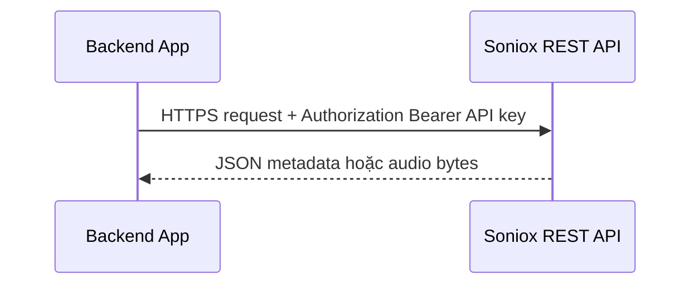

Dùng cho:

- Tạo temporary API key.
- Upload/list/get/delete files.
- Create/list/get/delete transcriptions.
- Get transcript.
- Get models/TTS models.
- Usage logs/concurrency limits.
- TTS REST.

Ưu:

- Dễ triển khai, stateless.
- Phù hợp async jobs và batch request.

Nhược:

- Không phù hợp live transcription token-by-token, trừ TTS REST streaming audio.

### 4.2 Client direct stream

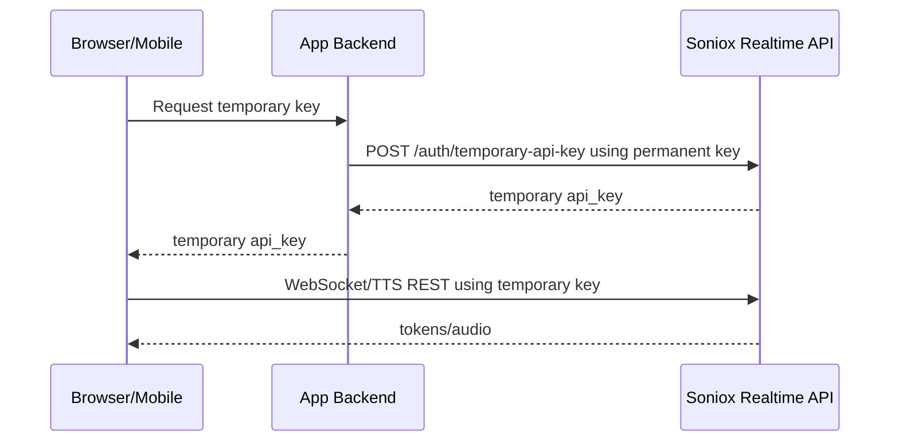

Dùng khi:

- Browser/mobile cần latency thấp.
- Không cần backend inspect/transform media stream.
- Chấp nhận client xử lý Soniox realtime protocol.

Ưu:

- Latency thấp.
- Backend không chịu bandwidth audio lớn.
- Scale đơn giản hơn cho realtime.

Nhược:

- Client phải quản lý WebSocket/audio/protocol.
- Cần temporary key và expiry/scope handling.

### 4.3 Backend proxy stream

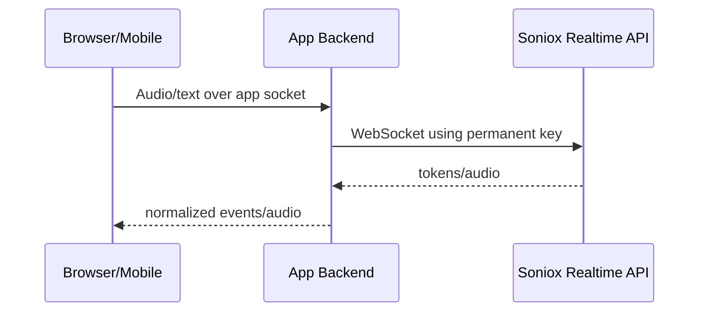

Dùng khi:

- Backend cần logging/audit/transformation/moderation.
- Muốn giấu toàn bộ Soniox credentials, kể cả temporary key.
- Muốn chuẩn hóa protocol riêng cho client.

Ưu:

- Kiểm soát auth/policy tập trung.
- Dễ gắn business logic.
- Dễ lưu audio/transcript hoặc transform payload.

Nhược:

- Thêm latency.
- Backend chịu bandwidth và concurrency.
- Cần xử lý backpressure, reconnect, timeout, error propagation.

### 4.4 SDK connection

Soniox có SDK Python, Node, Web, React, React Native. SDK bọc các API trên:

| SDK | Dùng cho |
|---|---|
| Python SDK | Backend/server scripts, async jobs, realtime examples |
| Node SDK | Backend Node.js, realtime/async/TTS flows |
| Web SDK | Browser STT/TTS realtime trực tiếp với temporary key |
| React SDK | React hooks/components cho STT/TTS realtime |
| React Native SDK | Mobile/Expo realtime workflows |

SDK không thay đổi primitive chính: REST, STT WebSocket, TTS WebSocket, temporary key.

## 5. Luồng nghiệp vụ chi tiết

### 5.1 Luồng STT real-time transcription

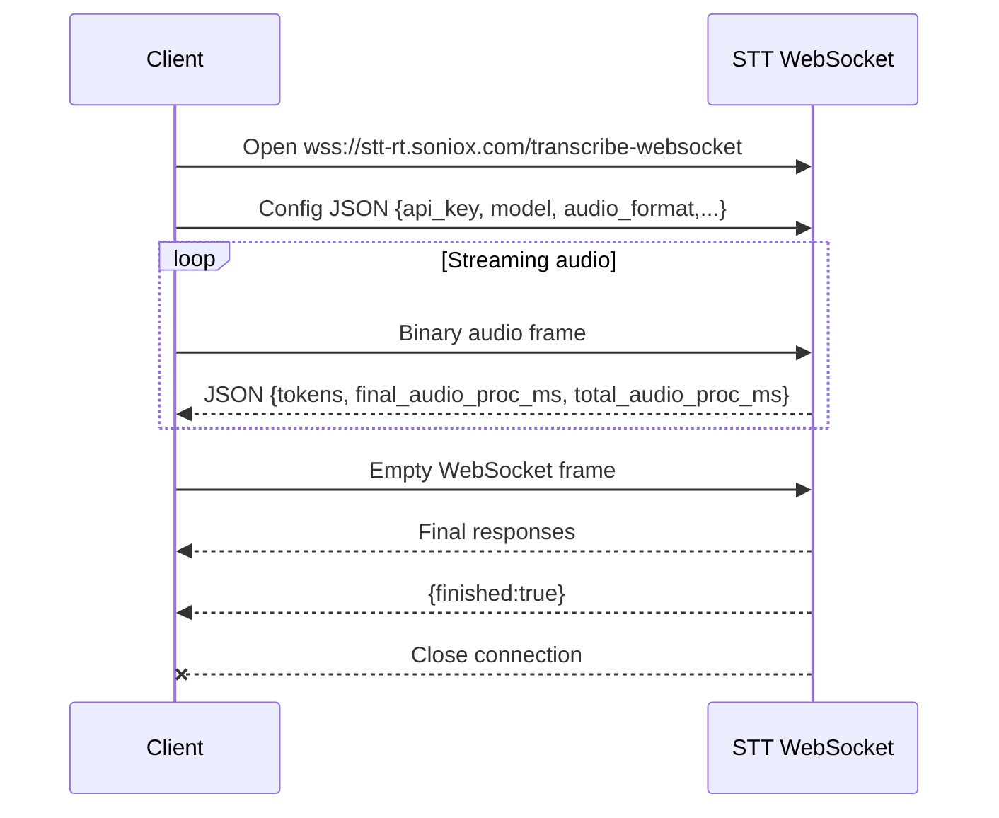

Client render logic:

1. Append tokens có `is_final: true` vào transcript ổn định.
2. Render tokens có `is_final: false` vào vùng provisional; vùng này có thể bị replace ở response sau.
3. Không append lại final tokens vì final tokens chỉ gửi một lần.
4. Dùng `final_audio_proc_ms` để biết audio đã finalize đến đâu.
5. Dùng `total_audio_proc_ms` để biết tổng audio đã xử lý gồm provisional.

Audio format:

| Mode | Config | Supported |
|---|---|---|
| Auto-detect | `{ "audio_format": "auto" }` | `aac`, `aiff`, `amr`, `asf`, `flac`, `mp3`, `ogg`, `wav`, `webm` |
| Raw | `audio_format`, `sample_rate`, `num_channels` | PCM signed/unsigned/float, `mulaw`, `alaw` |

Raw PCM example:

```json
{
  "audio_format": "pcm_s16le",
  "sample_rate": 16000,
  "num_channels": 1
}
```

### 5.2 Luồng STT real-time với endpoint detection

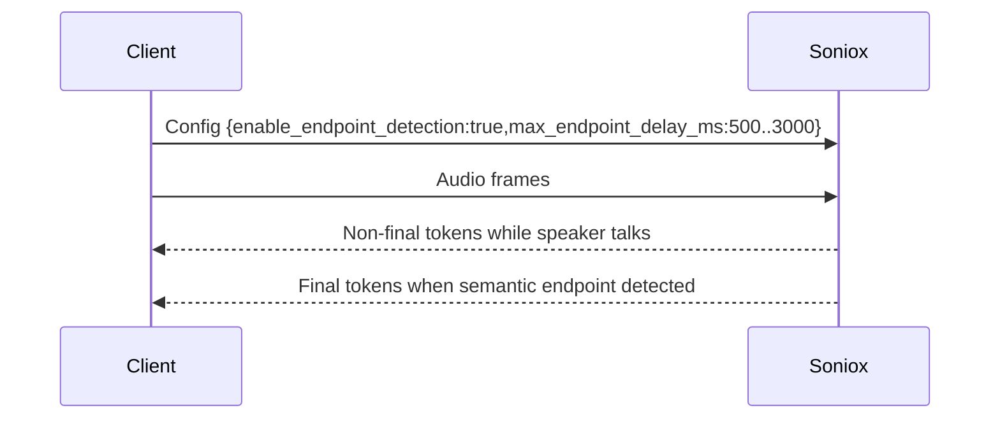

Ý nghĩa:

- Endpoint detection phát hiện khi speaker kết thúc utterance.
- Khi endpoint detected, Soniox finalize tokens trước đó nhanh hơn.
- Không đóng WebSocket và không thay thế empty frame kết thúc stream.
- `max_endpoint_delay_ms` thấp hơn trả endpoint sớm hơn; range 500..3000.

### 5.3 Luồng STT real-time với manual finalization

Client gửi control message:

```json
{"type":"finalize"}
```

Hiệu ứng:

- Soniox finalize audio đến thời điểm đó.
- Có thể tiếp tục stream audio sau `finalize`.
- Có thể gọi nhiều lần trong một session.
- Không nên gọi quá dày; docs khuyến nghị sau khoảng 200ms silence sau end-of-speech để cân bằng accuracy/latency.
- Muốn kết thúc hoàn toàn vẫn phải gửi empty frame và chờ `finished`.

### 5.4 Luồng STT keepalive

Keepalive message:

```json
{"type":"keepalive"}
```

Dùng khi:

- Tạm dừng audio nhưng muốn giữ connection.
- Chờ user nói tiếp.
- Muốn giữ context/session state.

Điểm quan trọng:

- Nếu không có audio hoặc keepalive trong hơn 20 giây, connection có thể bị đóng.
- Keepalive là control message, không phải audio.

### 5.5 Luồng STT async với `audio_url`

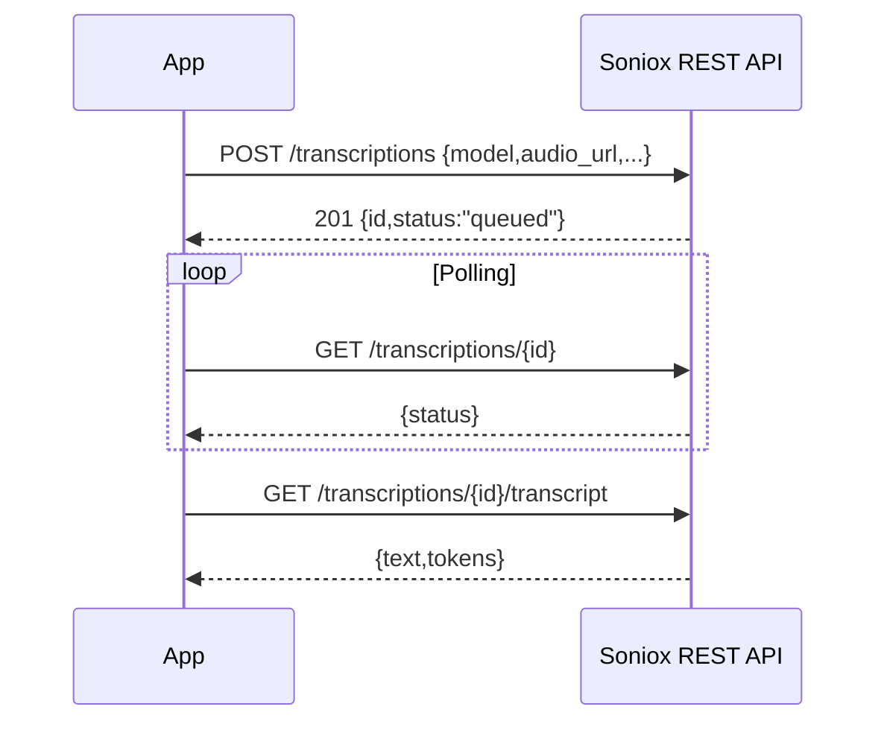

Pseudo steps:

1. Host audio ở URL public HTTPS.
2. `POST /v1/transcriptions` với `audio_url`.
3. Poll `GET /v1/transcriptions/{id}` cho đến `completed` hoặc `error`.
4. Nếu `completed`, gọi `GET /v1/transcriptions/{id}/transcript`.
5. Nếu `error`, đọc `error_type` và `error_message` trong transcription object.

### 5.6 Luồng STT async với file upload

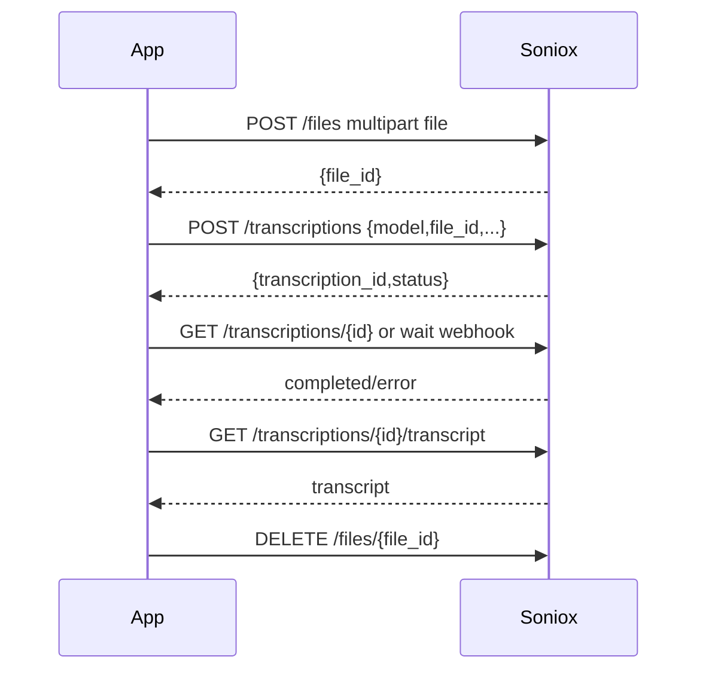

Điểm quan trọng:

- Dùng upload khi audio không có public URL.
- Dọn file sau khi lấy transcript vì file không tự xóa.
- Không xóa transcription đang processing; sẽ nhận `409 transcription_invalid_state`.

### 5.7 Luồng async webhook

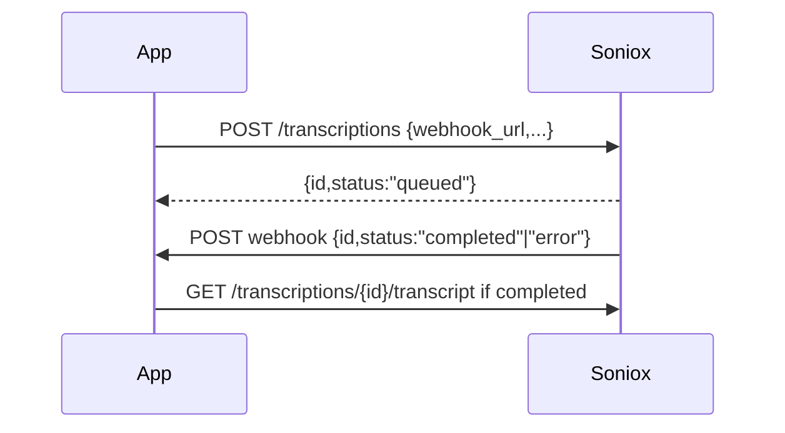

Webhook setup:

```json
{
  "model": "stt-async-v4",
  "audio_url": "https://example.com/audio.mp3",
  "webhook_url": "https://example.com/webhook",
  "webhook_auth_header_name": "Authorization",
  "webhook_auth_header_value": "Bearer <my-secret-token>"
}
```

Webhook behavior:

- Soniox POST tới `webhook_url` khi job `completed` hoặc `error`.
- Webhook payload có transcription `id` và `status`.
- Có thể thêm metadata bằng query params trên `webhook_url`.
- Nếu delivery fail, Soniox retry nhiều lần trong thời gian ngắn; nếu tất cả fail, delivery bị coi là permanently failed.
- Nên log transcription IDs app-side để recover khi webhook fail.
- Handler nên idempotent vì retry có thể tạo duplicate delivery.

### 5.8 Luồng speech-to-text translation real-time

One-way translation config:

```json
{
  "translation": {
    "type": "one_way",
    "target_language": "fr"
  }
}
```

Two-way translation config:

```json
{
  "translation": {
    "type": "two_way",
    "language_a": "ja",
    "language_b": "ko"
  }
}
```

Flow:

1. Mở STT WebSocket.
2. Gửi config có block `translation`.
3. Stream audio.
4. Nhận token gốc và token dịch trong cùng token stream.
5. Render dựa trên `translation_status`, `language`, `source_language`.
6. Kết thúc bằng empty frame, chờ `finished`.

Token translation fields:

| Field | Ý nghĩa |
|---|---|
| `translation_status: "none"` | Token không dịch |
| `translation_status: "original"` | Spoken token gốc có thể được dịch |
| `translation_status: "translation"` | Token bản dịch |
| `language` | Ngôn ngữ của `text` |
| `source_language` | Ngôn ngữ nguồn cho translated token |

Lưu ý:

- Spoken/original tokens có `start_ms`, `end_ms`.
- Translation tokens không có timestamps.
- Original và translation không map 1-1 tuyệt đối.
- `context.translation_terms` giúp ép thuật ngữ khi dịch.

### 5.9 Luồng speech-to-text translation async

Flow giống STT async, thêm `translation` trong create transcription:

```json
{
  "model": "stt-async-v4",
  "audio_url": "https://example.com/audio.mp3",
  "translation": {
    "type": "two_way",
    "language_a": "en",
    "language_b": "es"
  },
  "context": {
    "translation_terms": [
      { "source": "stroke", "target": "ictus" }
    ]
  }
}
```

Kết quả transcript chứa unified token stream gồm original và translation tokens.

### 5.10 Luồng TTS REST

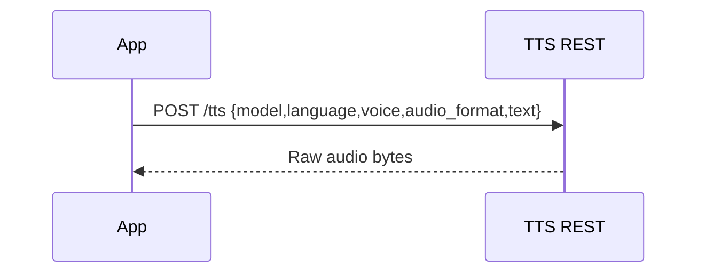

Dùng khi:

- Input text đã sẵn sàng đầy đủ.
- Không cần audio bắt đầu trước khi hoàn thành text.
- Muốn request/response đơn giản.

Pseudo:

```bash
curl -X POST "https://tts-rt.soniox.com/tts" \
  -H "Authorization: Bearer <SONIOX_API_KEY>" \
  -H "Content-Type: application/json" \
  --output speech.mp3 \
  -d '{
    "model":"tts-rt-v1",
    "language":"en",
    "voice":"Adrian",
    "audio_format":"mp3",
    "text":"Hello from Soniox."
  }'
```

### 5.11 Luồng TTS real-time WebSocket

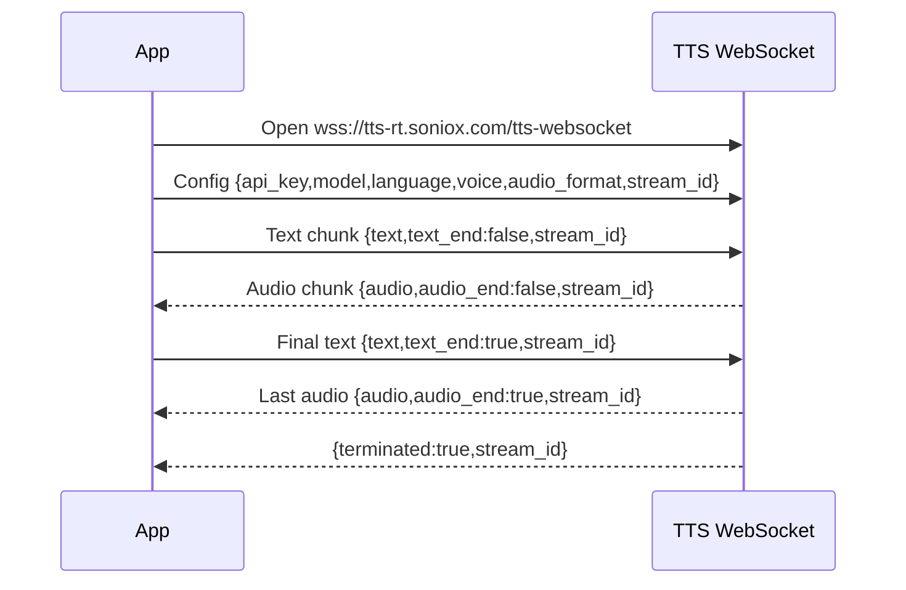

Dùng khi:

- LLM output đang stream từng token/chunk.
- Voice agent cần latency thấp.
- Cần phát audio trước khi toàn bộ text hoàn tất.

### 5.12 Luồng TTS real-time nhiều streams trên một connection

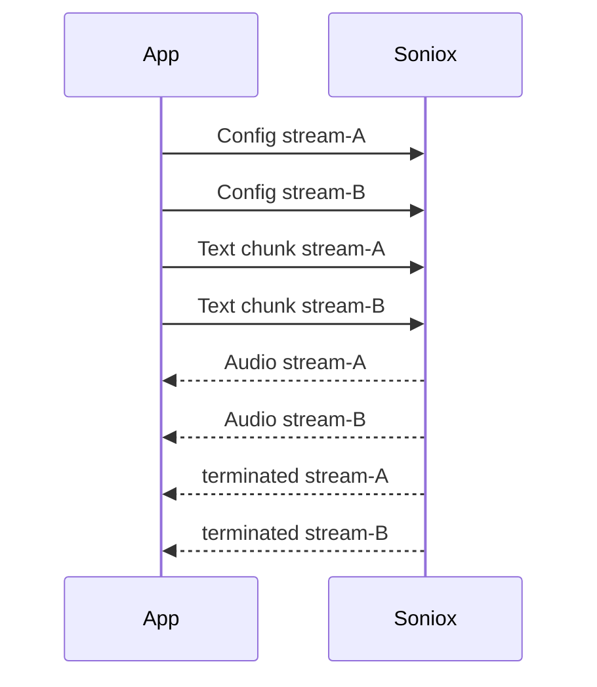

Rules:

- Tối đa 5 streams trên một WebSocket connection.
- Mỗi stream start bằng config riêng có unique `stream_id`.
- Response nào cũng phải route theo `stream_id`.
- Mark stream complete chỉ sau `terminated: true`.

### 5.13 Luồng TTS termination/cancel/error

Normal termination handshake:

1. Client gửi final text chunk với `text_end: true`.
2. Server gửi last audio chunk với `audio_end: true`.
3. Server gửi `{ "terminated": true, "stream_id": "..." }`.
4. Sau `terminated: true`, client mới release stream state hoặc reuse `stream_id`.

Cancel:

```json
{
  "stream_id": "stream-001",
  "cancel": true
}
```

Server trả:

```json
{
  "terminated": true,
  "stream_id": "stream-001"
}
```

Error termination:

```json
{
  "stream_id": "stream-001",
  "error_code": 400,
  "error_type": "invalid_request",
  "error_message": "Missing model",
  "more_info": "https://soniox.com/docs/api-reference/errors#invalid-request",
  "request_id": "3d37a3bd-5078-47ee-a369-b204e3bbedda"
}
```

Sau stream-level error, server gửi `terminated: true` cho `stream_id` đó; connection vẫn mở nếu không phải connection-level failure.

### 5.14 Luồng TTS keepalive

Keepalive dùng khi WebSocket idle:

- Đang chờ upstream LLM sinh thêm text.
- Muốn giữ connection mở giữa các streams để reuse.
- Keepalive áp dụng cho toàn connection, không gắn `stream_id`.
- Keepalive không sinh audio và không thay thế `text_end`.

## 6. Limits và quotas quan trọng

### 6.1 STT real-time WebSocket

| Limit | Default/Value | Ghi chú |
|---|---:|---|
| Requests per minute | 100 | Vượt có thể bị 429 |
| Concurrent requests | 10 | Số WebSocket sessions active đồng thời |
| Stream duration | 300 phút | Cố định, không tăng được; muốn tiếp tục phải mở session mới |

### 6.2 STT async

| Limit | Default/Value | Ghi chú |
|---|---:|---|
| Uploaded files | 1,000 | Maximum stored files at once |
| File duration | 300 phút | Cố định, không tăng được |
| File cleanup | Manual | Files không tự xóa |

### 6.3 TTS REST

| Limit | Value | Ghi chú |
|---|---:|---|
| Requests per minute | 100 | Vượt có thể bị rate limit |
| Concurrent requests | 3 | Active HTTP requests đồng thời |
| Audio duration | 2 phút | Cố định, không tăng được |
| Text length | 5000 ký tự | Nêu trong error list |

### 6.4 TTS real-time WebSocket

| Limit | Value | Ghi chú |
|---|---:|---|
| Requests per minute | 100 | Vượt có thể bị rate limit |
| Concurrent streams | 3 | Tổng active TTS streams across WebSocket connections |
| Streams per connection | 5 | Cố định, không tăng được |
| Stream duration | 2 phút | Cố định; muốn tiếp tục thì start stream mới |

### 6.5 Temporary API key

| Limit | Value |
|---|---:|
| `expires_in_seconds` | 1..3600 |
| `max_session_duration_seconds` | 1..18000 |
| `client_reference_id` | max 256 ký tự |

## 7. Error handling

### 7.1 REST error shape

```json
{
  "status_code": 400,
  "error_type": "invalid_request",
  "message": "Your request did not pass validation.",
  "validation_errors": [
    {
      "error_type": "missing",
      "location": "body.payload.model",
      "message": "Field required"
    }
  ],
  "request_id": "3d37a3bd-5078-47ee-a369-b204e3bbedda",
  "more_info": "https://soniox.com/docs/api-reference/errors#invalid-request"
}
```

### 7.2 WebSocket/TTS error shape

```json
{
  "error_code": 400,
  "error_type": "invalid_request",
  "error_message": "Missing model",
  "more_info": "https://soniox.com/docs/api-reference/errors#invalid-request",
  "request_id": "3d37a3bd-5078-47ee-a369-b204e3bbedda"
}
```

TTS WebSocket thêm `stream_id`.

### 7.3 Error types quan trọng

| HTTP/Code | Error type | Ý nghĩa | Hướng xử lý |
|---:|---|---|---|
| 400 | `invalid_request` | Request/config/body/query sai | Sửa payload, validate trước khi gửi |
| 400 | `invalid_cursor` | Pagination cursor sai | Bỏ cursor, query lại từ đầu |
| 400 | `model_not_available` | Model không hỗ trợ/không available | Gọi models endpoint, chọn model hợp lệ |
| 400 | `invalid_stream_state` | TTS stream state sai | Check `stream_id`, `text_end`, cancel/terminated lifecycle |
| 400 | `max_concurrent_streams_reached` | TTS WS vượt streams per connection | Chờ stream terminate, cancel stream, hoặc mở connection khác |
| 401 | `unauthenticated` | API key sai/missing/expired/sai temporary scope | Refresh key, kiểm tra Bearer/schema/scope |
| 402 | `organization_balance_exhausted` | Hết balance org | Nạp tiền/enable autopay |
| 402 | `organization_monthly_budget_exhausted` | Vượt monthly budget org | Tăng budget |
| 402 | `project_monthly_budget_exhausted` | Vượt monthly budget project | Tăng budget |
| 403 | `temp_api_key_session_expired` | Temporary key session quá `max_session_duration_seconds` | Tạo temporary key mới |
| 404 | `file_not_found` | File ID không tồn tại/khác project/đã xóa | Verify ID/project |
| 404 | `transcription_not_found` | Transcription ID không tồn tại/khác project/đã xóa | Verify ID/project |
| 408 | `request_timeout` | Backend deadline exceeded | Retry với backoff |
| 409 | `transcription_invalid_state` | Transcript chưa ready hoặc không thể delete khi processing | Poll/wait webhook; retry khi completed/error |
| 429 | `limit_exceeded` | RPM/concurrency/quota limit | Backoff, throttle, giảm concurrency, request limit increase |
| 500 | `internal_error` | Server error | Retry với backoff, log `request_id` |
| 503 | `service_unavailable` | Service overload/shutdown/cache exhausted | Retry với backoff, restart stream nếu cần |

### 7.4 Nguyên tắc xử lý lỗi

- Branch logic theo `error_type`, không parse `message`/`error_message`.
- Log `request_id` cho mọi lỗi để Soniox support trace.
- Retry có exponential backoff cho `408`, `429`, `500`, `503`.
- Không retry mù `400`; sửa request trước.
- Với WebSocket STT, error đóng connection; cần mở session mới nếu retry.
- Với TTS WebSocket, stream-level error chỉ kết thúc stream đó; connection có thể tiếp tục dùng.

## 8. Checklist chọn API

| Nhu cầu | API nên dùng | Lý do |
|---|---|---|
| Live captions hoặc voice agent STT | STT WebSocket | Token stream realtime, latency thấp |
| Recorded audio dài | STT async | Background processing, webhook/polling |
| File local không có public URL | Files API + STT async | Upload trước, dùng `file_id` |
| Live speech translation | STT WebSocket + `translation` | Original/translation token stream trong cùng connection |
| Translate recorded audio | STT async + `translation` | Transcript + translation sau khi job complete |
| TTS từ text ngắn/đã hoàn tất | TTS REST | Simple request, raw audio response |
| TTS từ LLM streaming | TTS WebSocket | Audio bắt đầu trước khi text hoàn tất |
| Browser/mobile trực tiếp Soniox | Temporary key + direct stream | Không lộ permanent API key |
| Cần audit/transform stream | Proxy stream qua backend | Backend kiểm soát media/results |
| Theo dõi chi phí/quota | Usage logs + concurrency limits | Correlate bằng `client_reference_id`, đọc current/limits |

## 9. Nguồn tham khảo

| Chủ đề | URL |
|---|---|
| Overview | https://soniox.com/docs/ |
| API reference | https://soniox.com/docs/api-reference |
| Errors | https://soniox.com/docs/api-reference/errors |
| STT WebSocket API | https://soniox.com/docs/api-reference/stt/websocket-api |
| STT real-time transcription | https://soniox.com/docs/stt/rt/real-time-transcription |
| STT real-time keepalive | https://soniox.com/docs/stt/rt/connection-keepalive |
| STT endpoint detection | https://soniox.com/docs/stt/rt/endpoint-detection |
| STT manual finalization | https://soniox.com/docs/stt/rt/manual-finalization |
| STT real-time limits | https://soniox.com/docs/stt/rt/limits-and-quotas |
| STT async transcription | https://soniox.com/docs/stt/async/async-transcription |
| STT async webhooks | https://soniox.com/docs/stt/async/webhooks |
| STT async limits | https://soniox.com/docs/stt/async/limits-and-quotas |
| Create transcription | https://soniox.com/docs/api-reference/stt/transcriptions/create_transcription |
| Get transcriptions | https://soniox.com/docs/api-reference/stt/transcriptions/get_transcriptions |
| Get transcription | https://soniox.com/docs/api-reference/stt/transcriptions/get_transcription |
| Get transcript | https://soniox.com/docs/api-reference/stt/transcriptions/get_transcription_transcript |
| Delete transcription | https://soniox.com/docs/api-reference/stt/transcriptions/delete_transcription |
| Upload file | https://soniox.com/docs/api-reference/stt/files/upload_file |
| Get files | https://soniox.com/docs/api-reference/stt/files/get_files |
| Get file | https://soniox.com/docs/api-reference/stt/files/get_file |
| Delete file | https://soniox.com/docs/api-reference/stt/files/delete_file |
| Get STT models | https://soniox.com/docs/api-reference/stt/get_models |
| Speech-to-text translation | https://soniox.com/docs/translation/stt-translation |
| Realtime STT translation | https://soniox.com/docs/translation/stt-translation/rt-translation |
| Async STT translation | https://soniox.com/docs/translation/stt-translation/async-translation |
| TTS REST generate | https://soniox.com/docs/api-reference/tts/generate_tts |
| TTS REST guide | https://soniox.com/docs/tts/rest-api/generate-speech |
| TTS REST limits | https://soniox.com/docs/tts/rest-api/limits-and-quotas |
| TTS WebSocket API | https://soniox.com/docs/api-reference/tts/websocket-api |
| TTS real-time generation | https://soniox.com/docs/tts/rt/real-time-generation |
| TTS streams | https://soniox.com/docs/tts/rt/streams |
| TTS termination | https://soniox.com/docs/tts/rt/termination |
| TTS keepalive | https://soniox.com/docs/tts/rt/connection-keepalive |
| TTS real-time limits | https://soniox.com/docs/tts/rt/limits-and-quotas |
| Get TTS models | https://soniox.com/docs/api-reference/tts/get_tts_models |
| Temporary API keys guide | https://soniox.com/docs/guides/temporary-api-keys |
| Create temporary API key | https://soniox.com/docs/api-reference/auth/create_temporary_api_key |
| Direct stream | https://soniox.com/docs/guides/direct-stream |
| Proxy stream | https://soniox.com/docs/guides/proxy-stream |
| Concurrency limits guide | https://soniox.com/docs/guides/concurrency-limits |
| Get concurrency limits | https://soniox.com/docs/api-reference/other/get_concurrency_limits |
| Usage logs guide | https://soniox.com/docs/guides/usage-logs |
| Get usage logs | https://soniox.com/docs/api-reference/other/get_usage_logs |
